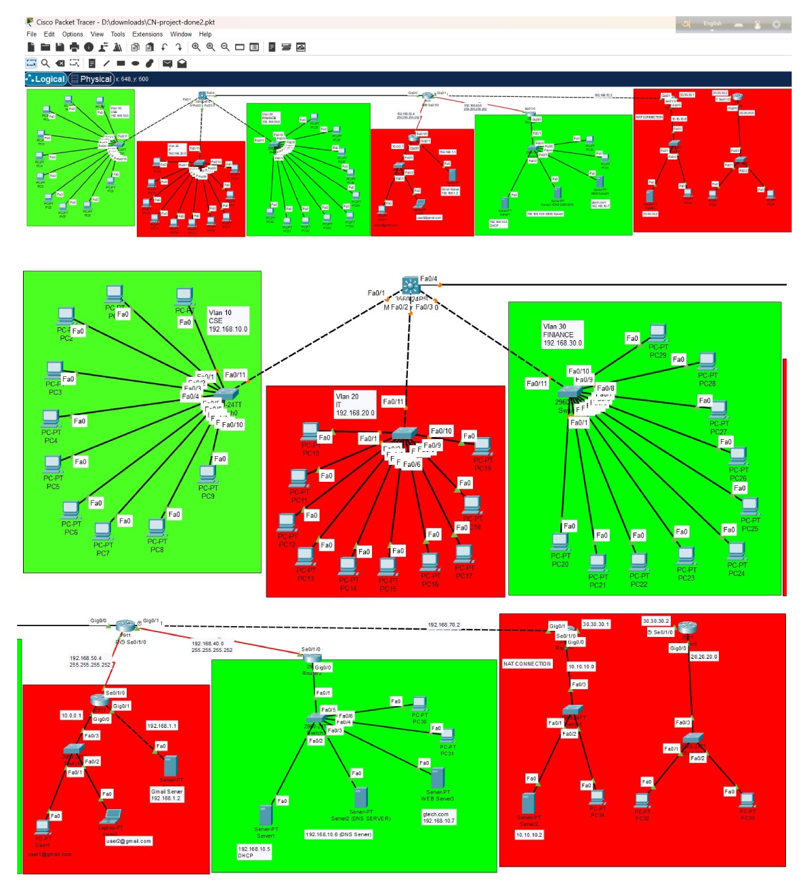

# 🏢 Enterprise Network with Departments

This project simulates a real-world enterprise network consisting of multiple departments. It was developed using **Cisco Packet Tracer** as part of the **CSE322: Computer Network Lab** course at **Daffodil International University**.

---

---

## 🎯 Objective

To design and implement a secure, scalable, and modular enterprise-level network architecture that demonstrates:

- VLAN-based departmental segmentation  
- EIGRP and OSPF dynamic routing  
- Centralized services (DNS, HTTP, SMTP)  
- NAT and ACLs for internet access and security  
- DHCP for automated IP address allocation  
- Realistic enterprise behavior using simulation tools

---

## 🛠 Technologies Used

- **Cisco Packet Tracer**  
- VLANs & VLSM Subnetting  
- Dynamic Routing: **EIGRP & OSPF**  
- DHCP, DNS, HTTP, SMTP  
- NAT & ACLs  
- Layer 2 and Layer 3 networking devices

---

## 📁 Included Files

| File Name                             | Description                                |
|--------------------------------------|--------------------------------------------|
| `Computer_Network_Project_Report.pdf`| Detailed project documentation              |
| `Computer Network project.pkt`       | Network simulation file for Packet Tracer  |
| `screenshot.png`                     | Visual overview of the network topology    |
| `README.md`                          | Project overview and guide                 |
| [Packet Tracer 8.2.2 Setup (64-bit)](https://drive.google.com/drive/folders/1hPltHv9p1KFn4sRgOlAzKWtNpegIabhm?usp=drive_link) | Cisco Packet Tracer installer              |

---

## 🚀 How to Run the Simulation

1. **Install Cisco Packet Tracer**  
   👉 [Download Packet Tracer 8.2.2 (64-bit)](https://drive.google.com/drive/folders/1hPltHv9p1KFn4sRgOlAzKWtNpegIabhm?usp=drive_link)

2. **Open the `.pkt` file**  
   Launch Packet Tracer and open:  
   `Computer Network project.pkt`

3. **Test the network**  
   - Use `ping`, `traceroute` to verify connectivity  
   - Visit the internal web server: `http://gtech.com`  
   - Test internal email with configured SMTP server (`gmail.com`)  
   - Check IP auto-assignment via DHCP  
   - Inspect NAT and ACL behavior using simulation

---

## 📊 Key Features

✅ VLAN segmentation for HR, IT, Finance, etc.  
✅ Efficient IP allocation with VLSM  
✅ Inter-VLAN routing using trunk links & sub-interfaces  
✅ Hybrid routing using **EIGRP + OSPF**  
✅ ACL implementation for department-level access control  
✅ NAT for simulated internet access  
✅ Server configured with **DNS**, **SMTP**, **HTTP**  
✅ DHCP-enabled router for IP assignment

---

## 👥 Team Members

| Name                    | Student ID             | Role                                 |
|-------------------------|------------------------|--------------------------------------|
| Shariar Ahamed Ripon    | 0242310005101019       | Project Planner, DHCP Configuration  |
| Md Moniruzzaman Rifat   | 0242310005101020       | VLAN & Email Server Setup            |
| Nabanita Gain           | 0242310005101309       | Report Writing, Web Server Config    |
| Sumaiya Akter Sammi     | 0242310005101520       | DNS Server Configuration             |
| Sultana Asma Islam      | 0242310005101682       | NAT Implementation                   |

---

## 📚 Academic Info

- **Course**: CSE322 - Computer Network Lab  
- **Department**: Computer Science and Engineering  
- **University**: Daffodil International University  
- **Supervisor**: Ms. Chayti Saha (Lecturer, DIU)  
- **Submission Date**: April 16, 2025

---

## 🎓 Learning Outcomes

- Hands-on implementation of enterprise networking  
- Mastery of VLAN, routing, NAT, DHCP, DNS, HTTP, SMTP  
- Network security through ACLs and segmentation  
- Applying theoretical knowledge to realistic scenarios  
- Familiarity with Cisco Packet Tracer and CLI commands

---

## 🧩 Future Improvements

- Switch to **GNS3** or **EVE-NG** for real Cisco IOS images  
- Implement **IPv6**, **firewalls**, and **IDS/IPS** systems  
- Add cloud integration (VPN/SD-WAN)  
- Use **SNMP**, **NetFlow**, or **Zabbix** for monitoring  
- Introduce **network automation** with Python / Ansible

---

## 📄 License

This project is for academic and educational purposes only.  
All rights reserved © 2025 by the contributors.
